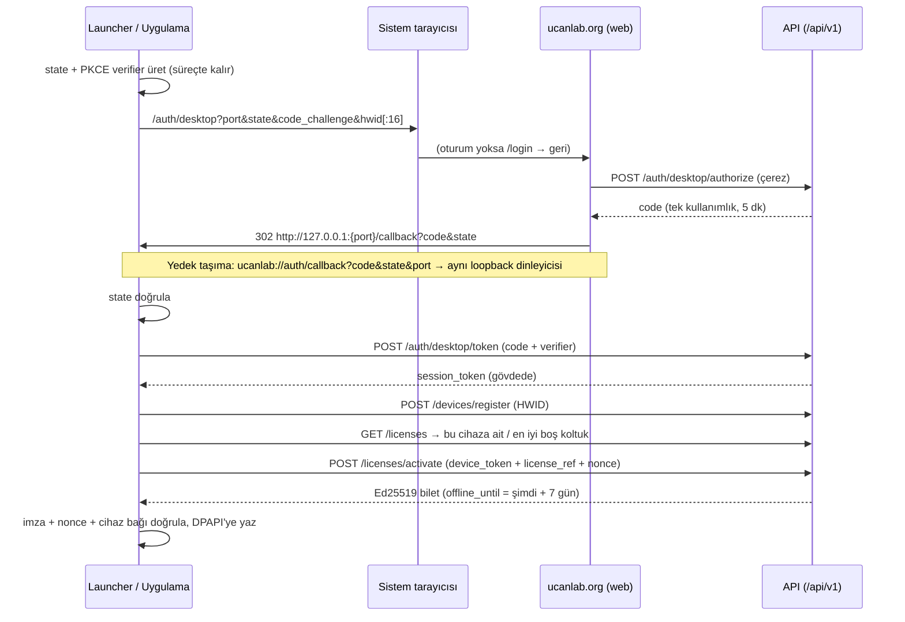

# Bulut Giriş ve Lisans Sözleşmesi (Desktop ↔ UCANLAB-CLOUD)

> Aşama 3 · Makine-okunur kaynak: [`cloud_auth_contract.v1.json`](cloud_auth_contract.v1.json)
> Bu dosyanın bayt-bayt kopyası UCANLAB-CLOUD `backend/tests/contracts/` altındadır. İki depo aynı SHA-256'yı sabitler; bir tarafta değişirse o tarafın CI'ı diğer depo güncellenene kadar kırmızı olur.

## 1. Akışın özeti

Tarayıcı dönmezse **cihaz kodu** (RFC 8628): uygulama `POST /auth/desktop/device/start` ile `XXXX-XXXX` kodu alır, kullanıcı bunu herhangi bir cihazdan `ucanlab.org/cihaz` sayfasında onaylar, uygulama `POST /auth/desktop/device/token` ile (PKCE verifier dahil) yoklar. Sonrası aynı: kayıt → lisans → bilet.

## 2. Uç noktalar

Temel yol `/api/v1`. Tüm hata yanıtları `{"error": {"code", "message", "request_id"}}` zarfındadır.

| # | Uç nokta | Kimlik | Çağıran | Durum |
|---|---|---|---|---|
| 1 | `POST /auth/desktop/authorize` `{port, code_challenge, code_challenge_method:"S256", state}` → `{code, redirect_uri, expires_in}` | Tarayıcı çerezi | Web | Mevcut |
| 2 | `POST /auth/desktop/token` `{code, code_verifier, redirect_uri}` → `{session_token, token_type, user}`; hata `400 invalid_grant` | Yok (kod = kimlik) | Masaüstü | Mevcut |
| 3 | `POST /auth/desktop/device/start` `{code_challenge, code_challenge_method, client_name}` → `{device_code, user_code, verification_uri, verification_uri_complete, expires_in:600, interval:5}` | Yok | Masaüstü | **Yeni** |
| 4 | `POST /auth/desktop/device/approve` `{user_code, decision:"approve"\|"deny"}` → `{status, client_name}`; hata `400 invalid_user_code` | Tarayıcı çerezi | Web `/cihaz` | **Yeni** |
| 5 | `POST /auth/desktop/device/token` `{device_code, code_verifier}` → `{session_token, token_type, user}`; hata `400` + `authorization_pending` / `slow_down` / `expired_token` / `access_denied` / `invalid_grant` | Yok | Masaüstü | **Yeni** |
| 6 | `GET /auth/me` | Oturum | Masaüstü | Mevcut |
| 7 | `POST /devices/register` `{device_name, hwid(hex64), app_version}` → `201 {device_id, device_token, hwid_resets_remaining}` | Oturum + Teknisyen rolü | Masaüstü | Mevcut |
| 8 | `GET /licenses` → `[{license_ref, tier, features, expires_at, is_active, device_id, …}]` | Oturum | Masaüstü | Mevcut (yeni kullanım) |
| 9 | `POST /licenses/activate` `{device_token, license_ref, nonce}` → `{license_token, expires_at, offline_until}`; `403` uyuşmazlık, `409` başka cihaza bağlı | Oturum + Teknisyen rolü | Masaüstü | Mevcut |
| 10 | `POST /licenses/refresh` `{device_token, hwid, license_ref, nonce}` → `{license_token, expires_at, offline_until}`; `403` + sebep kodu (`DEVICE_REJECTED`, `ORGANIZATION_INACTIVE`, `LICENSE_NOT_FOUND`, `LICENSE_REVOKED`, `LICENSE_EXPIRED`, `SEAT_NOT_HELD`), dakikada 20 istek | **Oturumsuz**: cihaz jetonu + kayıtlı HWID | Masaüstü | **Yeni (S10)** |

Hız sınırları (istemci kimliği başına, dakikada): `device/start` 10, `device/token` 30, `device/approve` 10, `desktop/token` 20.

### Sabitler
Loopback portları `47820, 47821, 47822` · geri çağırma yolu `/callback` · derin bağlantı `ucanlab://auth/callback` · onay sayfası `/cihaz` · kullanıcı kodu alfabesi `BCDFGHJKLMNPQRSTVWXZ23456789` (sesli harf ve benzer karakter yok) · bilet şeması `1` · çevrimdışı süre 7 gün (sunucu belirler).

## 3. Otomatik lisans seçimi (istemci kuralı)

Lisans **seçimi** için sunucuda lisans mantığı değiştirilmedi (yenileme için bkz. §4); istemci mevcut `GET /licenses` + `POST /licenses/activate` uçlarını kullanır (`src/security/cloud/desktop_auth.py::select_license`):
1. Bu cihaza zaten bağlı, aktif ve süresi geçmemiş lisans varsa o (koltuk korunur).
2. Yoksa en iyi **boş** koltuk: katman sırası `enterprise > fleet > pro = heavy_duty_pro = marine_pro > starter`, eşitlikte en geç biten.
3. Başka cihaza bağlı lisans **asla** seçilmez; taşıma HWID sıfırlama akışının işidir.
4. Uygun lisans yoksa "Hesabınızda bu bilgisayar için boş lisans yok" mesajı.

Katman → mod yetkisi: tüm geçerli lisanslar Tamirci modunu açar; Mühendis modu `pro, heavy_duty_pro, marine_pro, fleet, enterprise`; araca yazan işlemler (kod silme, aktif test) `active_tests` özelliği ister. Bilinmeyen katman Mühendis modunu açmaz (fail-closed).

## 4. Çevrimdışı çalışma

- Bilet Ed25519 ile gömülü anahtarla doğrulanır; geçerlilik `min(exp, offline_until)`.
- Uygulama ve launcher her açılışta çevrim içiyse bileti sessizce yeniler (`refresh_online`, launcher'da `refresh_silently`), böylece 7 günlük pencere ileri kayar. İnternet yoksa kayıtlı bilet süresi bitene kadar çalışır.
- **Cihaz yenilemesi (S10, kullanıcı onayı 2026-10-01):** yenileme önce `POST /licenses/refresh` ile, **kullanıcı oturumu olmadan**, cihaz jetonu + kayıtlı HWID ile yapılır. Böylece tarayıcı oturumu (24 saat) bitse de tamirci her hafta yeniden giriş yapmak zorunda kalmaz; tarayıcıda giriş yalnız ilk kurulumda, cihaz/lisans değişince ya da yenileme reddedilince gerekir. Uç **yalnız bu cihaza zaten bağlı** koltuğu yeniler, boş koltuk almaz. Lisans iptal edilmiş, süresi dolmuş, koltuk başka cihaza taşınmış ya da atölye hesabı kapatılmışsa reddeder; istemci bu kesin retlerde kayıtlı bileti **hemen siler** (7 günü beklemez) ve sade mesaj gösterir. Cihaz reddi (`DEVICE_REJECTED`, ör. donanım parmak izi değişti) bileti silmez; oturum varsa eski etkinleştirme yolu denenir, yoksa bilet süresince çalışır.
- Süre dolunca: "Lisansınızın çevrimdışı süresi doldu. İnternete bağlanıp yeniden giriş yapın; kayıtlarınız silinmez."
- Saat geri alınırsa kalıcı, HMAC'li yüksek su işareti (HWM) `CLOCK_ROLLBACK_DETECTED` üretir: "Bilgisayarın saati geri alınmış görünüyor…"

## 5. Lisans kapısı (değişmedi)

Launcher'daki L-1 kapısı aynen korunur: lisanssız makine ana uygulamaya ulaşamaz. Yeni olan, kapı kapalıyken launcher'ın **kapının önünde** giriş yaptırmasıdır (etkileşimli konsolda, `--no-sign-in` ile kapatılabilir). Giriş başarılı olursa ön kontrol yeniden çalışır; ana uygulama yalnız geçen bir ön kontrolden sonra başlar.

## 6. Güvenlik incelemesi

| Tehdit | Önlem | Kanıt (test) |
|---|---|---|
| **CSRF / state enjeksiyonu** (saldırgan kendi kodunu kurbanın uygulamasına iter) | 24 baytlık `state` süreçte üretilir; geri çağırmada birebir karşılaştırılır; uyuşmazsa kod **hiç takas edilmez**. | `test_loopback_callback_rejects_state_mismatch`, masaüstü `test_desktop_web_login_flow` |
| **Kod ele geçirme** (loopback yarışı, tarayıcı geçmişi, özel şema gaspı) | PKCE S256: verifier süreci terk etmez; kod 5 dk, tek kullanımlık, DB'de yalnız özeti. Port listesi sabit, `SO_EXCLUSIVEADDRUSE`. `ucanlab://` bağlantısı yalnız kod+state taşır, aynı dinleyiciye gider; kimlik bilgisi parametresi görülürse reddedilir. | `test_loopback_code_is_useless_without_verifier`, `test_parse_deep_link_*`, `test_forward_deep_link_targets_loopback_only`, bulut `test_desktop_sso.py` |
| **Cihaz kodu sızması** | Cihaz kodu PKCE'ye bağlı; verifier'sız yoklama `invalid_grant` ve yoklama saatini ilerletmez. | `test_device_code_verifier_is_required`, bulut `test_leaked_device_code_needs_verifier` |
| **Kullanıcı kodu tahmini** | ~38 bit, 10 dk ömür, onay oturum ister, dakikada 10 deneme, karar kesin (sonradan çevrilemez), bilinmeyen/biçimsiz kod aynı hata. | `test_decision_is_final`, `test_unknown_and_malformed_user_codes_fail_identically`, `test_start_is_rate_limited` |
| **Uzaktan oltalama (RFC 8628 §5.4)** | Protokol ayıramaz. Onay sayfası "yalnız kendi ekranınızdaki kodu girin" uyarısı ve "Bu ben değilim" (reddet) butonu gösterir. **Kalan risk kabul edildi** (Açık soru S11). | Web `/cihaz` |
| **Replay** (eski bilet/yanıt tekrar oynatma) | Etkinleştirmede istemci 16 baytlık nonce üretir, biletteki nonce eşleşmezse reddedilir; kodlar tek kullanımlık (atomik UPDATE). | Mevcut `NONCE_MISMATCH`, `test_grant_is_single_use`, `test_token_exchange_code_is_single_use` |
| **Bilet klonlama** | Bilet `device_id`'ye bağlı; kayıtlı cihaz kimliği yoksa doğrulama fail-closed. | Mevcut `test_ticket_verification_rejects_device_mismatch` |
| **Saat manipülasyonu** | Kalıcı HMAC'li HWM + monotonik saat çapraz kontrolü; `min(exp, offline_until)`. | `test_clock_rollback_is_reported_not_trusted`, `test_offline_use_until_offline_until_then_clear_message` |
| **Sır sızıntısı (URL/log)** | Tarayıcı URL'inde yalnız port, state, challenge ve HWID'in 16 karakteri. Verifier/cihaz kodu/oturum `repr`'de gizli, log'a yazılmaz; oturum jetonu yalnız yanıt gövdesinde, DPAPI'de saklanır; CRLF içeren jeton reddedilir. | `test_browser_url_carries_only_public_values`, `test_pkce_session_repr_hides_secrets`, `test_complete_login_rejects_bad_token` |
| **Koltuk yarışı** | Başka cihaza bağlı lisans seçilmez; yarış kaybedilirse (409) "Lisansınız başka bir bilgisayarda kullanılıyor" mesajı. | `test_complete_login_seat_race_is_explained` |
| **Cihaz yenilemesinin kötüye kullanımı** (çalınan cihaz jetonu) | Jeton DPAPI'de; tek başına yetmez, kayıtlı HWID de eşleşmeli (sabit zamanlı karşılaştırma). Uç koltuk **almaz**, yalnız bu cihazdaki koltuğu yeniler; HWID sıfırlama/taşıma sonrası eski cihazın isteği reddedilir; her yenileme denetim kaydına yazılır (`license.refresh`); dakikada 20 istek. Bilet yine `device_id`'ye bağlıdır. | bulut `test_license_refresh.py` (8 test), masaüstü `test_device_refresh_*`, `test_definitive_refusal_drops_the_ticket` |
| **İptal gecikmesi** | İptal edilen lisans, internete bağlı cihazda bir sonraki açılışta (kesin ret → bilet silinir) kapanır; çevrimdışı cihazda en geç 7 gün. | `test_definitive_refusal_drops_the_ticket` |
| **Komut satırı enjeksiyonu (URL protokolü)** | Kayıt komutu `"%1"` tek tırnaklı argüman; alıcı URL'i katı doğrular. | `test_url_protocol_registration_quotes_argument` |

## 7. Açık sorular (Aşama 3'ten)

| # | Soru | Şimdilik |
|---|---|---|
| S10 | ~~Cihaz jetonuyla yenileme ucu eklensin mi?~~ **Karar (2026-10-01, kullanıcı): eklendi** — `POST /licenses/refresh`, bkz. §4. | — |
| S11 | Cihaz kodu oltalama riski kabul edilebilir mi, yoksa onay sayfasında istek IP/ülke bilgisi mi gösterilsin? (kişisel veri) | Uyarı metni + reddet butonu. |
| S12 | Launcher şu an konsol programı; pencereli (konsolsuz) paketlenirse cihaz kodu nerede gösterilecek? | Konsolda gösterilir; `HARDWARE_TEST_CHECKLIST.md`'de doğrulanacak. |

## 8. Doğrulama durumu

- **CI/simülatör:** istemci `tests/unit/test_desktop_auth.py` (sahte bulut, gerçek HTTP + Ed25519) ve `test_cloud_auth_contract.py`; bulut `test_desktop_device_flow.py` ve `test_desktop_auth_contract.py`.
- **Doğrulanmadı (Windows/gerçek ortam):** DPAPI yazma/okuma, `ucanlab://` kayıt defteri kaydı, gerçek tarayıcı yönlendirmesi, Windows güvenlik duvarı, `SO_EXCLUSIVEADDRUSE` davranışı → `HARDWARE_TEST_CHECKLIST.md`.
