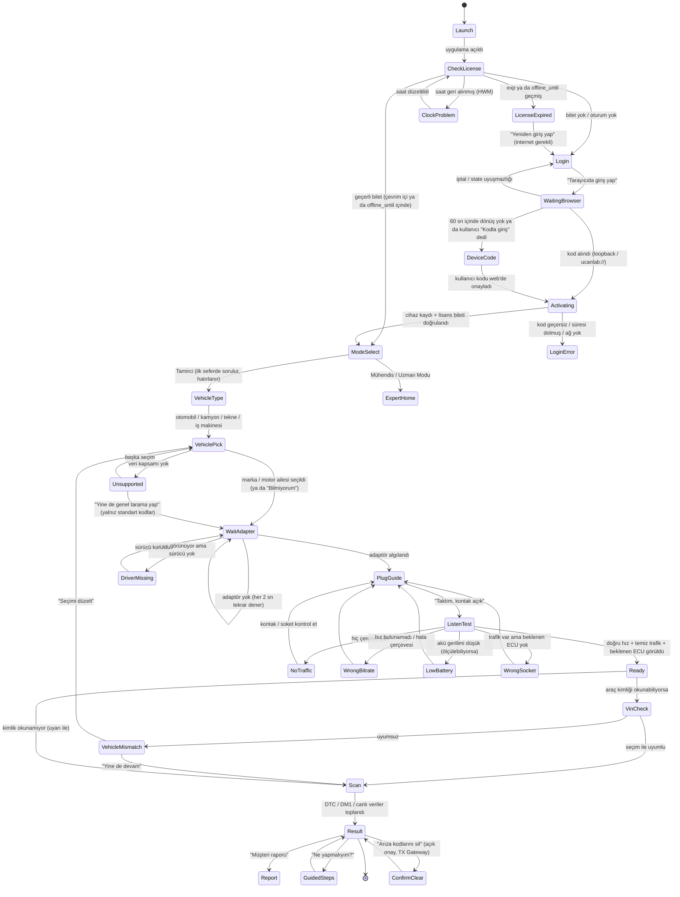

# Tamirci Akışı (Mechanic Flow) — Şartname

> Durum: **Aşama 1 — yalnız doküman.** Bu dosya uygulama kodu değiştirmez.
> Sonraki aşamalar: 2 tasarım demosu (onay noktası) → 3 giriş/yetki → 4 mod/araç → 5 adaptör sihirbazı → 6 tarama/teşhis → 7 uçtan uca test.

## 0. Ürün ilkeleri (her kararın süzgeci)

1. **Önce tamirci.** Varsayılan ekranlar teknik bilgisi olmayan bir ustaya göre tasarlanır.
2. **Jargon yok.** Teknik bir terim görünmek zorundaysa yanında tek cümlelik açıklama olur.
3. **Uydurma teşhis yok.** Emin değilse "emin değilim" der ve eksik veriyi söyler. Güvenlik riski varsa ilk satırda uyarır.
4. **Varsayılan çevrimdışı.** İlk girişten sonra lisansın `offline_until` süresi boyunca internetsiz çalışır.
5. **Mühendis araçları ikincil.** Sniffer, osiloskop, tersine mühendislik, flaş, aktif test → "Uzman Modu".

## 1. Kapsam ve varsayımlar

| Konu | Varsayılan (bu şartnamede kabul edilen) |
|---|---|
| Platform | Windows masaüstü uygulaması (pywebview + React ön yüz, `src/ui/desktop_app.py`). |
| Giriş | Sistem tarayıcısında `ucanlab.org` oturumu → PKCE + tek kullanımlık kod. Birincil dönüş kanalı **mevcut loopback** (`127.0.0.1:47820-47822`), ek kanal `ucanlab://` derin bağlantısı, son yedek **cihaz kodu**. Bkz. §6.1. |
| Mod | "Tamirci" (varsayılan) / "Mühendis" (= Uzman Modu). İlk açılışta sorulur, yerel ayarda saklanır, Ayarlar'dan değişir. |
| Araç türleri | Otomobil, Kamyon/Otobüs, Tekne, İş makinesi/Tarım. |
| Adaptörler | PCAN, Kvaser (python-can), RP1210 (J1939 VCI'ler), Sanal/Simülatör. |
| Bağlantı testi | **Yalnızca dinleme (listen-only)**. Araca hiçbir çerçeve gönderilmez. |
| Dil | Türkçe birincil, İngilizce ikincil. Her ekran metni iki dilde tanımlıdır (§4). |

## 2. Durum makinesi

Notlar:
- `ListenTest` hiçbir koşulda TX yapmaz. Adaptör listen-only açılamıyorsa (donanım desteklemiyorsa) test **başlatılmaz**, kullanıcıya "Bu adaptör güvenli dinleme modunu desteklemiyor" denir.
- `VinCheck` ve OBD-II arıza kodu okuma **okuma isteği göndermek** (TX) gerektirir; bkz. §7.2 "salt-okuma istekleri". J1939 (kamyon/iş makinesi) DM1 ve NMEA 2000 (tekne) yayın mesajları dinlemeyle okunur, TX gerekmez.

## 3. Ekranlar — amaç, metin, butonlar

Her ekranda sağ üstte küçük "Uzman Modu" geçişi ve "Yardım" vardır. Metinler sade, en fazla iki cümle.

### 3.1 Açılış / Lisans kontrolü (`Launch`, `CheckLicense`)
- **Amaç:** Kullanıcıyı gereksiz ekranla meşgul etmeden oturum durumunu anlamak.
- **TR:** "UCanLab hazırlanıyor…" · **EN:** "Getting UCanLab ready…"
- **Buton:** yok (en fazla 2 sn). Hata olursa ilgili ekrana geçer.

### 3.2 Giriş (`Login`, `WaitingBrowser`)
- **Amaç:** Parola uygulamaya hiç yazılmadan, tarayıcıda giriş.
- **TR başlık:** "Hesabınıza giriş yapın" · **EN:** "Sign in to your account"
- **TR metin:** "Tarayıcınızda ucanlab.org açılacak. Giriş yaptıktan sonra buraya kendiliğinden döneceksiniz." · **EN:** "ucanlab.org will open in your browser. After you sign in, you'll come back here automatically."
- **Butonlar:** `Tarayıcıda giriş yap / Sign in with browser` (birincil) · `Kodla giriş yap / Sign in with a code` (ikincil) · `İptal / Cancel`
- **Bekleme metni:** "Tarayıcıda girişinizi bekliyoruz… / Waiting for you to sign in…" + `Tarayıcıyı tekrar aç / Open browser again`

### 3.3 Cihaz kodu yedeği (`DeviceCode`)
- **Amaç:** Tarayıcı dönüşü çalışmazsa (güvenlik duvarı, farklı cihazda giriş).
- **TR:** "Telefonunuzdan veya bilgisayarınızdan **ucanlab.org/cihaz** adresine gidin ve şu kodu girin: **KXQT-7M4P**. Kod 10 dakika geçerlidir." · **EN:** "On your phone or computer go to **ucanlab.org/device** and enter: **KXQT-7M4P**. The code is valid for 10 minutes."
- **Butonlar:** `Kodu kopyala / Copy code` · `İptal / Cancel`

### 3.4 Mod seçimi (`ModeSelect`) — yalnız ilk seferde
- **TR başlık:** "Uygulamayı nasıl kullanacaksınız?" · **EN:** "How will you use the app?"
- **Kart 1 — Tamirci / Mechanic:** "Arızayı bul, ne yapacağımı söyle. Teknik bilgi gerekmez." · "Find the fault and tell me what to do. No technical knowledge needed."
- **Kart 2 — Mühendis / Engineer:** "Ham CAN verisi, sinyal analizi ve uzman araçları." · "Raw CAN data, signal analysis and expert tools."
- **Alt not:** "Bunu daha sonra Ayarlar'dan değiştirebilirsiniz. / You can change this later in Settings."
- Lisans katmanı Mühendis modunu kapsamıyorsa kart kilitli görünür: "Bu mod paketinizde yok. / Not included in your plan."

### 3.5 Araç türü (`VehicleType`)
- **TR:** "Hangi aracı kontrol ediyorsunuz?" · **EN:** "What are you checking?"
- **Seçenekler:** `Otomobil / Car` · `Kamyon, otobüs / Truck, bus` · `Tekne / Boat` · `İş makinesi, traktör / Construction, tractor`

### 3.6 Araç seçimi (`VehiclePick`)
- **TR:** "Marka veya motoru seçin" · **EN:** "Choose the make or engine"
- Liste yalnız **gerçekten verisi olan** seçenekleri etkin gösterir (§8). Verisi olmayan satır gri ve "Desteklenmiyor / Not supported" etiketli.
- **Butonlar:** `Bilmiyorum, genel tarama yap / I don't know — run a general scan` · `Devam / Continue`

### 3.7 Adaptör bekleme (`WaitAdapter`)
- **TR:** "Adaptörü bilgisayara takın." · **EN:** "Plug the adapter into the computer."
- Alt metin: "Takınca kendiliğinden bulacağız. / We'll detect it automatically."
- Algılanınca: "**PCAN-USB** bulundu ✓ / **PCAN-USB** found ✓"
- **Buton:** `Simülatörle dene / Try with simulator` (demo, eğitim, test)

### 3.8 Takma yönergesi (`PlugGuide`)
- Araç profiline göre soket resmi + tek cümle:
  - Otomobil: "Adaptör kablosunu direksiyonun altındaki 16 pinli OBD soketine takın ve **kontağı açın** (motoru çalıştırmayın)." / "Plug into the 16-pin OBD socket under the steering wheel and **turn the ignition on** (don't start the engine)."
  - Kamyon: "9 pinli yeşil veya siyah Deutsch sokete takın (genelde sürücü tarafında, dizin altında). Kontağı açın." / "Plug into the 9-pin green or black Deutsch socket (usually driver side, knee level). Ignition on."
  - Tekne: "NMEA 2000 omurgasındaki boş bir T-bağlantısına takın. Omurga beslemesi açık olmalı." / "Connect to a free T-connector on the NMEA 2000 backbone. Backbone power must be on."
  - İş makinesi: "Kabindeki 9 pinli teşhis soketine takın. Kontağı açın." / "Plug into the 9-pin diagnostic socket in the cab. Ignition on."
- **Buton:** `Taktım, kontak açık / Plugged in, ignition on`

### 3.9 Bağlantı testi (`ListenTest`)
- **TR:** "Araçla bağlantı kontrol ediliyor. Araca hiçbir şey gönderilmiyor, sadece dinliyoruz." · **EN:** "Checking the connection. Nothing is sent to the vehicle — we only listen."
- İlerleme adımları: "Hız bulunuyor → Trafik kontrol ediliyor → Beyinler (ECU) aranıyor" (jargon açıklaması: "ECU: aracın bir bölümünü yöneten bilgisayar").

### 3.10 Hazır (`Ready`)
- **TR:** "Hazır ✓ Araçla bağlantı kuruldu. 3 kontrol ünitesi görüldü." · **EN:** "Ready ✓ Connected to the vehicle. 3 control units found."
- **Buton:** `Taramayı başlat / Start scan`

### 3.11 Tarama (`Scan`)
- **TR:** "Arızalar okunuyor… (yaklaşık 20 sn)" · **EN:** "Reading faults… (about 20 s)"
- OBD-II (otomobil) için tarama öncesi **tek sefer onay** kutusu (bkz. §7.2): "Arıza kodlarını okumak için araca **okuma isteği** gönderilecek. Bu, araçta hiçbir ayarı değiştirmez." / "To read fault codes, a **read request** will be sent. It doesn't change anything in the vehicle." `Okumaya izin ver / Allow reading` · `Sadece dinle / Listen only`.

### 3.12 Sonuç (`Result`) — kart sırası sabittir
1. **Güvenlik uyarısı (varsa, ilk satır, kırmızı):** "⚠ Aracı sürmeyin: fren basıncı düşük." / "⚠ Do not drive: brake pressure is low."
2. **Kısa özet:** bir cümle.
3. **Aciliyet:** `Hemen / Now` · `Bu hafta / This week` · `Bir sonraki bakımda / Next service` · `Bilinmiyor / Unknown` (drive_safety_policy RED/YELLOW/GREEN/GRAY eşlemesi).
4. **Olası nedenler (gerekçeli):** en fazla 3, her birinde "Neden böyle düşünüyoruz" satırı ve kanıt kaynağı.
5. **Ne yapmalı:** basitten zora numaralı adımlar (önce sigorta/soket/kablo, sonra sensör, en son parça değişimi).
6. **Eksik veri ve nasıl alınır:** "Emin olmak için motor çalışırken 30 sn daha kayıt alın."
7. **Teknik detay (kapalı açılır bölüm):** kodlar, SPN/FMI, ham değerler.
8. **Kaynak kayıt:** hangi veri tabanı / kural (ör. "SAE J2012 genel kodu", "J1939 SPN veritabanı").
- **Butonlar:** `Ne yapmalıyım? / What should I do?` · `Müşteri raporu / Customer report` · `Arıza kodlarını sil… / Clear fault codes…` (açık onay) · `Yeni tarama / New scan`
- Kod veritabanında yoksa (dürüst ekran): "Bu kodu tanımıyoruz. Uydurmamak için yorum yapmıyoruz. Kod: P1ABC." / "We don't recognise this code. We won't guess. Code: P1ABC."

### 3.13 Müşteri raporu (`Report`)
- Tek sayfa: araç, tarih, bulunan arızalar (sade dil), aciliyet, önerilen işlem, "Bu rapor otomatik teşhis önerisidir; kesin karar ustanındır." notu. PDF/HTML çıktı (mevcut `src/engine/exporters/pdf_report.py`).

### 3.14 Arıza silme onayı (`ConfirmClear`)
- **TR:** "Arıza kodları silinecek. Arıza giderilmediyse kodlar geri gelir ve uyarı lambası yeniden yanar. Motor çalışmıyor olmalı." · **EN:** "Fault codes will be cleared. If the fault isn't fixed they'll come back. Engine must be off."
- Onay kutusu + `Sil / Clear` (TX Gateway + E-Stop mimarisinden geçer; kısa ömürlü onay jetonu).

## 4. Hata senaryoları

| Durum | Nasıl anlaşılır | Kullanıcıya TR | EN | Çözüm butonu |
|---|---|---|---|---|
| Adaptör yok | Hiçbir arayüz bulunamadı (python-can `detect_available_configs` boş, RP1210 INI'de cihaz yok) | "Adaptör bulunamadı. USB kablosunu çıkarıp tekrar takın." | "No adapter found. Unplug and replug the USB cable." | `Tekrar dene` · `Simülatörle dene` |
| Sürücü yok | USB aygıtı var ama `PCANBasic.dll` / `canlib32.dll` / vendor RP1210 DLL yüklenemiyor | "Adaptör takılı ama sürücüsü kurulu değil. Üreticinin sürücüsünü kurun: [PEAK / Kvaser / VCI üreticisi]." | "Adapter found but its driver is missing. Install the maker's driver." | `Sürücü sayfasını aç` · `Kurdum, tekrar dene` |
| Hatta trafik yok | Listen-only, tüm aday hızlarda 0 çerçeve | "Araçtan veri gelmiyor. Kontak açık mı? Soket tam oturdu mu?" | "No data from the vehicle. Is the ignition on? Is the plug fully seated?" | `Tekrar dene` |
| Kontak kapalı | 0 çerçeve **ve** (ölçülebiliyorsa) akü < 12.8 V / 25.6 V olmadan dinlenme gerilimi | "Kontak kapalı görünüyor. Anahtarı 'açık' konuma getirin (motoru çalıştırmayın)." | "Ignition seems off. Turn the key to ON (don't start)." | `Kontağı açtım` |
| Akü zayıf | Adaptör gerilim bildiriyorsa (RP1210 bazı VCI'ler; PCAN/Kvaser **bildirmez**) < 11.8 V (12 V sistem) / < 23.6 V (24 V) | "Akü zayıf (11.2 V). Sonuçlar yanıltıcı olabilir. Önce aküyü şarj edin." | "Battery is weak (11.2 V). Results may be misleading. Charge it first." | `Yine de devam` · `İptal` |
| Yanlış hız / hata çerçevesi | `scan_bitrate` tüm adaylarda reddetti ya da `error_frames > 0` | "Araçla dil uyuşmadı. Doğru soketi kullandığınızdan emin olun." | "Couldn't match the vehicle's data speed. Check you're on the right socket." | `Tekrar dene` |
| Yanlış soket / yanlış ağ | Trafik temiz ama profildeki beklenen ECU/PGN hiç görünmüyor (ör. kamyonda J1939 PGN 61444 yok) | "Veri geliyor ama beklediğimiz motor beyni yok. Başka bir teşhis soketi olabilir." | "Data is flowing but the engine unit isn't there. There may be another diagnostic socket." | `Soket yerlerini göster` |
| Lisans süresi dolmuş | `LICENSE_EXPIRED` ya da `offline_until` geçmiş | "Lisansınızın çevrimdışı süresi doldu. İnternete bağlanıp yeniden giriş yapın; kayıtlarınız silinmez." | "Your offline period has ended. Connect to the internet and sign in again; your data is kept." | `Yeniden giriş yap` |
| İnternet yok (ilk giriş) | `/health` erişilemez, bilet yok | "İlk giriş için internet gerekli. Sonrasında 7 güne kadar internetsiz çalışır." | "First sign-in needs internet. After that it works offline for up to 7 days." | `Tekrar dene` · `Simülatörle dene` |
| İnternet yok (bilet geçerli) | Bilet `offline_until` içinde | Sessiz; üst çubukta küçük "Çevrimdışı · 5 gün kaldı" | "Offline · 5 days left" | — |
| Saat geri alınmış | `CLOCK_ROLLBACK_DETECTED` | "Bilgisayarın saati geri alınmış görünüyor. Saati düzeltin." | "The computer clock looks wrong. Please correct it." | `Tekrar dene` |
| Araç uyuşmazlığı | VIN/motor kimliği seçimle çelişiyor | "Seçtiğiniz: Scania. Araçtan okunan: Volvo D13. Hangisi doğru?" | "You chose Scania. The vehicle reports Volvo D13. Which is right?" | `Seçimi düzelt` · `Yine de devam` |
| Adaptör listen-only desteklemiyor | `set_listen_only` False döner / donanım onayı yok | "Bu adaptör güvenli dinleme modunu desteklemiyor, bağlantı testi yapılmadı." | "This adapter can't do safe listen-only mode; test not run." | `Başka adaptör` |
| Tarama sırasında kopma | LINK-FAULT gözlemcisi (`desktop_app.py` HW error streak) | "Bağlantı koptu. Kablo yerinden çıkmış olabilir." | "Connection lost. The cable may have come loose." | `Yeniden bağlan` |

## 5. Çevrimdışı davranış

| Özellik | Çevrim içi | Çevrimdışı (bilet geçerli) | Çevrimdışı (bilet yok/dolmuş) |
|---|---|---|---|
| Giriş | Tarayıcı + PKCE | Gerekmez | Mümkün değil → net mesaj |
| Mod/araç seçimi, adaptör, dinleme testi | ✓ | ✓ | Yalnız Simülatör (demo) |
| Tarama + teşhis (copilot) | ✓ (yerel motor) | ✓ (yerel motor, LLM yok) | ✗ |
| Müşteri raporu | ✓ | ✓ (yerel PDF/HTML) | ✗ |
| Buluta oturum yükleme | Kullanıcı onayıyla | Kuyruğa alınmaz (açıkça "çevrim içi olunca yükleyin") | ✗ |
| Bilet yenileme | Her açılışta sessizce (rolling `offline_until` = +7 gün, sunucu `license_service.py`) | — | — |

- Çevrimdışı süre sunucunun verdiği `offline_until` ile sınırlıdır; istemci uzatamaz.
- Saat manipülasyonu: kalıcı HWM (`logs/license_hwm.txt`, HMAC'li) + monotonik saat karşılaştırması mevcut (§9).

## 6. Giriş ve yetkilendirme tasarımı (Aşama 3 özeti)

### 6.1 Dönüş kanalı seçimi
1. **Loopback (birincil, mevcut):** RFC 8252 §7.3. `127.0.0.1:{47820|47821|47822}/callback`, `SO_EXCLUSIVEADDRUSE`. Sunucu tarafı ve web sayfası (`web/app/auth/desktop`) hazır.
2. **`ucanlab://auth/callback` (ek):** Windows'ta kayıt defteri protokol işleyicisi gerektirir (kurulum paketinin işi). Özel URI şemaları başka bir uygulama tarafından da kaydedilebildiği için (RFC 8252 §8.8) **PKCE zorunlu** ve kod tek kullanımlık; tek başına güven kaynağı değildir.
3. **Cihaz kodu (yedek):** RFC 8628. Tarayıcı dönüşü mümkün değilse. Sunucuda **henüz yok** → `CLOUD_AUTH_CONTRACT.md`.

**Aşama 3 kararı:** Lisanssız makinede ana uygulama hiç başlamaz (launcher L-1 kapısı). Bu kapıyı gevşetmemek için ilk giriş **launcher'da, kapının önünde** yapılır: launcher tarayıcıyı açar, kodu kendi loopback dinleyicisinde alır, lisansı etkinleştirir ve ön kontrolü yeniden çalıştırır. Uygulama içindeki giriş ekranı (`SignInGate`) yalnız çalışırken süre dolması ve doğrudan başlatma durumları içindir. Ayrıntı: [`CLOUD_AUTH_CONTRACT.md`](CLOUD_AUTH_CONTRACT.md).

### 6.2 Akış
`state` (CSRF, 24 bayt) + PKCE S256 verifier uygulama sürecinde kalır → tarayıcı yalnız challenge görür → web `POST /auth/desktop/authorize` → kod loopback'e → uygulama `POST /auth/desktop/token` (verifier ile) → oturum jetonu DPAPI'ye → cihaz kaydı (`/devices/register`, HWID) → lisans bileti (`/licenses/activate`) → Ed25519 doğrulama → mod yetkisi.

### 6.3 Lisans katmanı → mod yetkisi (öneri)
| Katman (`tier`) | Tamirci | Mühendis (Uzman) | Arıza silme / aktif test |
|---|---|---|---|
| `starter` | ✓ | ✗ | ✗ |
| `pro`, `heavy_duty_pro`, `marine_pro` | ✓ | ✓ | yalnız `active_tests` özelliği varsa |
| `fleet`, `enterprise` | ✓ | ✓ | `active_tests` varsa |
| FREE / bilet yok | Simülatör demosu | ✗ | ✗ |

Not: "Arıza silme" bugün hiçbir özellik bayrağına bağlı değil → Açık soru S3.

## 7. Güvenlik kuralları (bozulmaz)

### 7.1 Değişmezler
- **G1 — TX varsayılan kapalı.** Hiçbir akış adımı kendiliğinden araca yazmaz. Mevcut: `PythonCanBus(listen_only=True)` varsayılanı, `TxSafetyGateway` (`src/safety/gateway.py:95`), `arm_tx` açık kullanıcı eylemi.
- **G2 — Bağlantı testi yalnız dinleme.** `scan_bitrate` her aday için `listen_only=True` açar (`src/hal/drivers/pcan_kvaser.py:623`). Donanım listen-only'yi onaylamıyorsa test yapılmaz.
- **G3 — Arıza silme / aktif test** ayrı ekran, açık onay, kısa ömürlü meydan okuma jetonu (`request_diagnostic_challenge` → `execute_diagnostic_action`), TX Gateway + E-Stop'tan geçer. Motor çalışıyorsa reddedilir (ölçülebiliyorsa).
- **G4 — AI bus'a yazamaz.** `tests/safety/test_ai_tx_isolation.py` korunur; copilot yalnız `READ_ONLY_AI_ACTIONS` önerebilir (`drive_safety_policy.py`).
- **G5 — Uydurma yok.** Copilot yalnız oturum kanıtından kart üretir (`user_report_composer.py`: "kanıt zinciri kapalı"); bilinmeyen kod → dürüst ekran.
- **G6 — Sır sızıntısı yok.** Token/parola/verifier URL'e (loopback'teki tek kullanımlık kod dışında) ve log'a düz yazılmaz; VIN log'da maskelenir (`mask_vin_in_text`).

### 7.2 Salt-okuma istekleri (TX ama zararsız) — karar
OBD-II arıza kodu (Mode 03/07/0A), VIN (Mode 09 PID 02) ve UDS `0x19`/`0x22` okumaları **istek çerçevesi göndermeyi** gerektirir. Bunlar araçta durum değiştirmez ama G1 gereği varsayılan kapalıdır. Öneri:
- Taramadan önce **tek sefer, oturum bazlı açık onay** ("Okumaya izin ver").
- İstekler TX Gateway'in **salt-okuma izin listesinden** geçer (servis/PID bazında beyaz liste; `0x14` silme, `0x2F`/`0x31` aktif test listede yok).
- Onay verilmezse yalnız dinleme verisiyle sonuç gösterilir ve eksik veri bölümü bunu söyler.
- J1939 DM1, NMEA 2000 yayınları: TX gerekmez. J1939 DM2 (geçmiş kodlar) PGN isteği gerektirir → aynı onay.

## 8. Araç türü → veri kapsamı (gerçek envanter)

| Araç türü | Protokol | Yerel veri | Kapsam kararı |
|---|---|---|---|
| Otomobil | OBD-II (ISO 15765-4, 500k/250k), UDS | `dtc_database.json` 14 484 kod; 177 binek DBC (OpenDBC; Toyota, VW, Ford, Hyundai/Kia, Honda, GM, Tesla…); `obd2_*.dbc` | Genel OBD-II: **destekli**. Markaya özel canlı sinyal: yalnız DBC'si olan modeller. |
| Kamyon/otobüs | J1939 (250k/500k) | `j1939_spn_fmi_database.json` 4 291 SPN; OEM çözücüler: Cummins, Caterpillar, Scania, Volvo, Detroit, Mercedes Actros | Genel J1939 **destekli**; bu 6 marka "zenginleştirilmiş". Diğerleri "genel J1939". |
| Tekne | NMEA 2000 (250k) | `canboat.dbc`, `n2k_canboat.dbc`, `canboat_pgn_reference.json` | Motor/sıvı/navigasyon izleme **destekli**; arıza kodu kavramı sınırlı (motor J1939 geçidi varsa). |
| İş makinesi/traktör | J1939 + ISOBUS (250k) | `isobus_*.dbc`, `j1939_isobus_*.dbc`, Caterpillar J1939 | Genel J1939 + ISOBUS **destekli**; marka listesi dar. |
| EV / hibrit | CAN 2.0B/FD | 17 EV/BMS DBC; `hv_safety_thresholds.json` | **Yüksek gerilim uyarısı zorunlu** (`EV_HV_WARNING_TR`). Tamirci modunda yalnız okuma. |

Araç profili (Aşama 4 veri modeli): `vehicle_type, make, engine_family, protocol, bitrate_candidates[], socket_type, expected_ecus[] (SA/PGN veya CAN ID), dbc_files[], supported: bool, notes`.

### 8.1 Aşama 4 uygulaması (E5–E7)

- **Katalog:** `data/vehicle_profiles.json` — 4 araç türü (protokol, soket, bit hızı adayları, pasif dinlemede beklenen PGN'ler, takma yönergesi) ve 41 marka/motor profili. Kapsam etiketi üç değerdir: `enriched` (markaya özel veri), `standard` (genel tarama), `unsupported` (gri, seçilemez, nedeni yazılı).
- **Dürüstlük denetimi:** `src/engine/vehicle/profiles.py::load_catalog` her yüklemede doğrular: `enriched` profilin `dbc_globs` deseni `data/dbc` altında gerçek bir dosyaya uymalı ya da `oem_decoder` kayıtlı bir J1939 OEM çözücüsü olmalı; `standard`/`unsupported` profil marka verisine atıf yapamaz; her türün en az bir seçilebilir profili olmalı. Uymayan katalog yüklenmez (`CATALOG_INVALID`).
- **Kimlik karşılaştırma:** `src/engine/vehicle/identity.py` — VIN'in WMI öneki (en uzun eşleşme, aynı tür öncelikli) ve J1939 adres taleplerindeki NAME üretici kodu (canboat tablosu + OEM çözücü eşlemesi). Sonuç `match / mismatch / unknown`; bilinmeyen WMI veya genel profil **asla tahmin üretmez**. VIN log'a yalnız maskeli yazılır (`YS2**********9401`).
- **Tercih:** mod ve son araç `%APPDATA%/…/mechanic_prefs.json` içinde atomik yazılır; bozuk dosya "yeniden sor" demektir. Lisans Mühendis modunu kapsamıyorsa köprü `ENGINEER_NOT_ALLOWED` döner ve hatırlanan Mühendis tercihi yok sayılır.
- **Köprü:** `mechanic_get_state`, `vehicle_catalog`, `vehicle_check_identity` (read); `mechanic_set_mode`, `vehicle_select` (config). Hiçbiri veriyoluna yazmaz.
- **Arayüz:** `MechanicFlow.tsx` (mod → tür → marka → takma yönergesi), Ayarlar › Donanım › "Kullanım modu". Yüksek voltajlı profilde güvenlik uyarısı ilk satırdadır. "Taktım, kontak açık" düğmesi Aşama 5'te bağlantı sihirbazına bağlanacak; bu aşamada mevcut ekrana geçer.
- **Doğrulama:** `tests/unit/test_vehicle_profiles.py` (katalog, kimlik, tercih, köprü) + tarayıcıda sahte köprüyle ekran görüntüsü. Gerçek araçta VIN/NAME okuması **doğrulanmadı** → `HARDWARE_TEST_CHECKLIST.md` W4-*.

### 8.2 Aşama 5 uygulaması (E8–E11)

- **Adaptör bulma** (`src/engine/connection/adapters.py`): PCAN (`PCANBasic` + bağlı kanallar), Kvaser (`canlib32`; Kvaser'in sanal kanalları gizlenir), RP1210 (INI `[VendorDIL]` satıcıları; cihazın takılı olduğu ancak bağlanınca anlaşılır → `driver_ready`), Linux SocketCAN (geliştirme), Simülatör. "Sürücü yok" ile "adaptör takılı değil" ayrı mesajlardır; bir üreticinin DLL'i çökerse yalnız o satır "kontrol edilemedi" olur.
- **Bağlantı testi** (`src/engine/connection/listen_test.py`): araç türünün bit hızı adaylarında sırayla **yalnız dinleme**; temiz trafik bulunan ilk hızda durur. Sonuç kodları ve sade mesajlar §4 tablosuyla birebir: `READY`, `QUIET_VEHICLE` (otomobil kendiliğinden konuşmuyor — normal), `EXPECTED_MISSING` (trafik var, beklenen PGN yok → başka soket), `NO_TRAFFIC`, `WRONG_BITRATE`, `BUS_ERROR`, `ADAPTER_ERROR`, `LISTEN_ONLY_UNAVAILABLE`, `CANCELLED`. J1939 PGN 65271 yayını varsa akü gerilimi okunur (12 V < 11.8, 24 V < 23.6 → uyarı, S6).
- **Güvenlik:** `listen_only=True` bayrağı olmayan veri yolu **açılmadan** reddedilir; bağlandıktan sonra durum `PASSIVE` değilse kapatılıp reddedilir; sürücünün `HARDWARE_LISTEN_ONLY_UNSUPPORTED` hatası "güvenli dinleme desteklenmiyor" mesajına çevrilir. Test kodu `send` çağırmaz; simülatörün `send`'i her zaman `SafetyError` verir. Gerçek adaptörde uygulamanın kendi veri yolu test süresince sanal kanala "park" edilir, başarıdan sonra bulunan hızla **yine dinleme modunda** adaptöre bağlanır (`_reconnect_bus` TX yetkisini de düşürür).
- **Simülatör** (`simulated_vehicle.py`): türün gerçek yayın PGN'leriyle (EEC1, ETC1, CCVS, ET1, EBC1, VEP1; N2K 127488/127489/127508; otomobil 11-bit) donanımsız çalışır; yanlış hızda yalnız hata çerçevesi üretir. Senaryolar: `ok`, `ignition_off`, `wrong_socket`, `weak_battery`, `bus_short`, `no_listen_only`. Çerçeveler `source="synthetic"` işaretlidir.
- **Köprü:** `adapter_scan`, `connection_test_status` (read); `connection_test_start`, `connection_test_cancel` (config). Arayüz: `ConnectWizard.tsx` (adaptör bekle → takma yönergesi → dinleme → Hazır / sorun).
- **Doğrulama:** `tests/unit/test_connection_wizard.py` (33 test; her §4 yolu simülatörde). Gerçek PCAN/Kvaser/RP1210 ile **doğrulanmadı** → `HARDWARE_TEST_CHECKLIST.md` W5-*.

### 8.3 Aşama 6 uygulaması (E12–E14) — tarama, teşhis, yönlendirme

- **Salt-okuma kanalı (kullanıcı kararı, 2026-09-30: "Salt-okuma kanalı"):** `src/safety/read_only_policy.py`. Açıkken geçitten yalnız şu çerçeveler geçer: 11-bit, klasik CAN, `0x7DF` veya `0x7E0–0x7E7`'ye, ISO-TP tek çerçeve ve servis baytı `0x01/0x03/0x07/0x09/0x0A`; ya da fiziksel adrese akış kontrolü `0x30`. Mode 04 (silme), tüm UDS servisleri, J1939, çok çerçeveli istek, CAN-FD ve kritik sınıflı her çerçeve reddedilir (`READ_ONLY_VIOLATION`). Politika süre sınırlıdır (120 sn).
- **Geçit:** `TxSafetyGateway` Aşama 2b (`src/safety/gateway.py`). Politika TX yetkisi bittiği an (PASSIVE/SAFE/FAULT) kendiliğinden düşer; sonradan yapılan tam arm onu devralamaz.
- **Uygulama:** `open_read_only_session` / `close_read_only_session` (`desktop_app.py`). `arm_tx` ile aynı çekirdeği kullanır (`_arm_driver_and_supervisor`). Tek fark: araç hızı **bilinmiyorsa** reddetmez, çünkü otomobil hızını ancak sorulunca söyler ve okuma isteği hiçbir şeyi hareket ettirmez. **Hareket eden araçta**, E-Stop'ta ve simülatör açıkken reddeder. Politika arm'dan **önce** kurulur; okuma bitince oturum her durumda kapatılır (`finally`). Tam `arm_tx` bilinmeyen hızda eskisi gibi kapalı kalır.
- **Onay:** "Okumaya izin ver" düğmesi yetmez; gerçek araçta işletim sisteminin onay penceresi de kabul edilmelidir (`_require_native_presence`). Tarama ekranı açıkken UI nabzı (watchdog) atar; pencere gizlenirse TX kendiliğinden kapanır.
- **Sıkılaştırma:** OBD Mode 04 (`0x04`, emisyon kodlarını siler) artık `CRITICAL_UDS_SIDS` içinde. Daha önce kritik sayılmıyordu.
- **Okuyucu** (`src/engine/diagnosis/obd_reader.py`): mevcut `ActiveDiagnosticPoller` ile motor (0x7E0) ve şanzıman (0x7E1) ünitesinden Mode 03/07/0A okur. Fiziksel adres kullanılır, böylece çok çerçeveli yanıtın akış kontrolü de fiziksel adrese gider. Not: poller'ın işlevsel (0x7DF) istekte akış kontrolünü 0x7DF'ye göndermesi ISO 15765-4'e aykırı; bu yol kullanılmıyor, ayrıca düzeltilmeli.
- **Tarama** (`scan.py`): dinle (kamyonda DM1 yayınları) → otomobilde izin varsa oku → analiz. Aynı kodun tekrar yayınları bir kez sayılır. Simülatörde aynı yol çalışır: kamyon DM1 (SPN 3251 FMI 0), otomobil için sahte ECU (P0301, P0420 kayıtlı; P0171 bekleyen), tekne için dürüst "kod yok".
- **Sonuç kartı** (`mechanic_result.py`): §3.12 sırası sabit. Nedenler ve adımlar yalnız bilgi tabanı kayıtlarından ve analiz motorundan gelir, uydurma değer yoktur. İngilizce kaynak metinleri ve SPN genelindeki (başka alt sisteme ait olabilen) kayıtlar tamirciye gösterilmez, yalnız teknik detayda kalır. "kesin" kelimesi gösterilmez. Bilinmeyen kod için "Bu kodu tanımıyoruz. Uydurmamak için yorum yapmıyoruz." yazar. Terimler sözlüğü ve kaynak satırı vardır.
- **Müşteri raporu:** sade metin + yazdırılabilir HTML (`scan_save_report`), atölye adı isteğe bağlı. Son satır: "Bu rapor otomatik teşhis önerisidir; son karar ustanındır."
- **Kod silme:** Sonuç ekranında yalnız lisans `dtc_clear` içeriyorsa görünür. Mevcut meydan okuma jetonu + TX Gateway + E-Stop yolundan geçer (`request_diagnostic_challenge` → `execute_diagnostic_action`); hız kilidi ve onay kuralları değişmedi.
- **Doğrulama:** `tests/unit/test_mechanic_scan.py` (45 test), tüm paket yerelde (xdist) 4450 geçti. Gerçek araçta **doğrulanmadı** → `HARDWARE_TEST_CHECKLIST.md` W6-*.

## 9. Mevcut kod neyi zaten karşılıyor (kanıt)

| İhtiyaç | Durum | Kanıt |
|---|---|---|
| Tarayıcıda giriş + PKCE + tek kullanımlık kod | ✅ Var (loopback) | `src/ui/desktop_app.py:364` (`_DESKTOP_LOOPBACK_PORTS`), `:399-407` (`_pkce_verifier/_pkce_challenge`), `:1285` (`cloud_start_web_login`), `:509` state kontrolü; sunucu `backend/app/routers/auth.py:325,360`, `services/desktop_auth_service.py` (tek kullanım, atomik UPDATE, özet saklama) |
| Loopback port gaspına karşı koruma | ✅ | `_ExclusiveHTTPServer` (`SO_EXCLUSIVEADDRUSE`) `desktop_app.py:369` |
| DPAPI sır saklama | ✅ | `src/safety/secret_provider.py` (DPAPI + yedek) |
| HWID | ✅ | `src/security/hwid/collector.py:342` |
| Cihaz kaydı + Ed25519 bilet | ✅ | `src/security/cloud/license_flow.py` (`register_device`, `activate_license`, `verify_cloud_ticket:454`, `kid` anahtar halkası) |
| Çevrimdışı süre (`offline_until`) | ✅ | `license_flow.py:686`; `src/launcher/auth.py` `is_offline=True`; sunucu rolling +7 gün `license_service.py:195-200` |
| Saat geri alma tespiti | ✅ | Kalıcı HMAC'li HWM (`default_license_hwm_path`), `CLOCK_ROLLBACK_DETECTED`, `CLOCK_MONOTONIC_MISMATCH` |
| Host allowlist, SPKI pinleme, güvenli yönlendirme | ✅ | `src/security/cloud/client.py` (`_SafeRedirectHandler`, `enforce_allowlist`) |
| Listen-only açılış | ✅ | `PythonCanBus(listen_only=True)` varsayılan, `set_listen_only:288`, `_hw_listen_only_confirmed:144`; `VirtualBus.set_listen_only` |
| Listen-only hız tarama | ✅ (tek arayüz için) | `PythonCanBus.scan_bitrate:623` (HAL-19: ≥10 temiz çerçeve, 0 hata) |
| RP1210 DLL/INI keşfi | ◐ Kısmi | `src/hal/rp1210/client.py:67` (`_rp1210_ini_candidates`), `_declared_vendor_dlls` — cihaz listesi kullanıcıya sunulmuyor |
| TX Gateway + E-Stop | ✅ | `src/safety/gateway.py:95`, `src/safety/estop.py:149`, `tests/safety/test_tx_chokepoint_architecture.py` |
| AI TX izolasyonu | ✅ | `tests/safety/test_ai_tx_isolation.py`, `drive_safety_policy.READ_ONLY_AI_ACTIONS` |
| J1939 DM1 çözümleme | ✅ | `src/protocols/j1939/diagnostics.py:16` |
| OBD poller / VIN çözme | ✅ (TX gerektirir) | `src/protocols/obd/poller.py`, `reassembly_pipeline.decode_vin_payload:96`, `diagnostic_copilot.make_uds_read_vin_action:224` |
| Sade kullanıcı kartı + risk bandı | ◐ | `user_report_composer.py` (başlık+özet+kaynak; "ne yapmalı" ve "nedenler" bilinçli olarak budanmış), `drive_safety_policy.py` RED/YELLOW/GREEN/GRAY |
| Dürüst "kod bulunamadı" | ✅ | `user_report_composer.py` §40 metni, `is_honest_card` |
| Rapor çıktısı | ◐ | `src/engine/ai/session_report.py` (teknisyen raporu, imzalı), `src/engine/exporters/pdf_report.py` — müşteri dilinde değil |
| Simülatör | ✅ | `VirtualBus`, `DesktopApiBridge.VALID_SCENARIOS` (nominal, misfire_p0300, overheat, j1939_multi_ecu_fleet, marine_vessel_n2k…) |

## 10. Eksikler (yapılacaklar listesi)

| # | Eksik | Aşama |
|---|---|---|
| E1 | İlk açılışta giriş ekranı yok; giriş Ayarlar içinde gömülü (`SettingsView.tsx`) | 3 |
| E2 | `ucanlab://` şeması ve cihaz kodu (RFC 8628) istemcide ve sunucuda yok | 3 |
| E3 | Giriş sonrası **otomatik** lisans etkinleştirme yok (bugün `activate_with_key` anahtar ister) — sunucuda "hesabımdaki lisansla etkinleştir" ucu gerekli | 3 (sunucu: DUR, lisans etkiler) |
| E4 | Katman → mod yetkisi eşlemesi yok | 3 |
| E5 | Mod seçimi (Tamirci/Mühendis) ve kalıcı tercih yok | 4 |
| E6 | Araç türü/marka seçimi ve `VehicleProfile` veri modeli yok | 4 |
| E7 | VIN/motor kimliği ile seçim karşılaştırması yok | 4 |
| E8 | Çoklu sürücü adaptör **keşfi** (PCAN/Kvaser/RP1210 listesi) ve "sürücü eksik" ayrımı yok | 5 |
| E9 | Sihirbaz durum makinesi (bekle → yönerge → dinle → hazır) yok; hata→sade mesaj eşlemesi yok | 5 |
| E10 | "Beklenen ECU görüldü mü" kontrolü yok (profil gerekli) | 5 |
| E11 | Akü gerilimi yalnız bazı RP1210 VCI'lerde okunabilir; genel yol yok (J1939 PGN 65271 yayın ile okunabilir) | 5 |
| E12 | TX Gateway'de salt-okuma izin listesi + tek sefer onay yok | 6 |
| E13 | Sonuç kartında "olası nedenler (gerekçeli)", "ne yapmalı", "eksik veri", "jargon sözlüğü" yok | 6 |
| E14 | Müşteri raporu (sade dil) yok | 6 |
| E15 | Tamirci akışı için Playwright E2E + ekran görüntüleri yok | 7 |

## 11. Açık sorular

| # | Soru | Varsayılan (cevap gelene kadar) |
|---|---|---|
| S1 | Giriş sonrası lisans nasıl seçilecek? Kullanıcının hesabında birden fazla lisans varsa? | Organizasyonun **en yüksek** aktif lisansı, boş koltuğu olan; yoksa "lisans yok" ekranı. Sunucu değişikliği lisansı etkilediği için **Aşama 3'te onay istenecek.** |
| S2 | `ucanlab://` kaydını hangi kurulum paketi yapacak? Bu repoda installer yok. | İstemci işleyiciyi yazar, kayıt komut satırı betiği + `HARDWARE_TEST_CHECKLIST.md`'de elle adım. Loopback birincil kalır. |
| S3 | Arıza silme hangi özellik bayrağına bağlı? (`active_tests` mi, yeni `dtc_clear` mi?) | `active_tests` yoksa kapalı. |
| S4 | OBD-II okuma isteği onayı her oturumda mı, bir kere mi? | Her oturumda (araç değişir). |
| S5 | Tamirci modunda Uzman araçlarına geçiş parola/PIN ister mi (atölyede çırak senaryosu)? | Hayır; lisans izin veriyorsa serbest geçiş. |
| S6 | Akü gerilimi ölçülemeyen adaptörlerde (PCAN/Kvaser) "akü zayıf" nasıl söylenecek? | Yalnız J1939 PGN 65271 yayınından; yoksa uyarı gösterilmez, "ölçülemedi" yazılır. |
| S7 | İş makinesi marka listesi (JCB, Komatsu, Hidromek…) için veri yok. Gösterilsin mi? | Gösterilir ama "genel J1939 ile taranır" etiketiyle. |
| S8 | Müşteri raporu logo/atölye bilgisi taşıyacak mı? | Ayarlar'da isteğe bağlı atölye adı; logo yok. |
| S9 | Çevrimdışı süre 7 gün yeterli mi (kırsal atölyeler)? | Sunucu değeri; istemci değiştirmez. Ürün kararı. |

## 12. Doğrulama politikası
- "CI/simülatör ile doğrulandı" ile "donanımda doğrulandı" ayrı yazılır. Donanım ve Windows'a bağlı her adım `docs/product/HARDWARE_TEST_CHECKLIST.md`'ye gider (Aşama 5/7).
- Bu doküman hiçbir donanım davranışını "test edildi" olarak iddia etmez.
